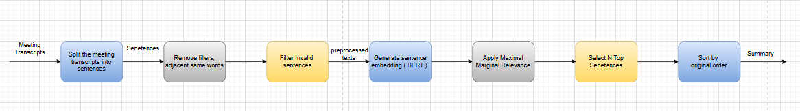

# MeetNotes 

A web application that helps users capture, summarize, and organize meeting discussions efficiently. It converts live speech into text, generates summaries and key points, and allows downloading notes as a PDF.

---

##  Features

-  **Live Speech-to-Text** using Web Speech Recognition API  
-  **Automatic Summarization** of meeting transcripts  
-  **Key Points Extraction** for quick insights  
-  **PDF Export** (Summary + Key Points)  
-  **Full Transcript View** after meeting  

---

##  Tech Stack

- **Frontend:** HTML, CSS, JavaScript  
- **Backend:** FastAPI (Python)  
- **NLP:** Sentence Transformers (BERT), MMR Algorithm  
- **Other Libraries:** NLTK, NumPy, Scikit-learn, NetworkX  

---

##  How It Works

1. User starts recording during a meeting  
2. Speech is converted into live text using Web Speech API  
3. After the meeting ends:
   - Full transcript is generated  
   - Summary is created using NLP techniques  
   - Key points are extracted  
4. User can download notes as a PDF  

---

##  Workflow

  

*Figure: Workflow of MeetNotes summarization pipeline*

---

